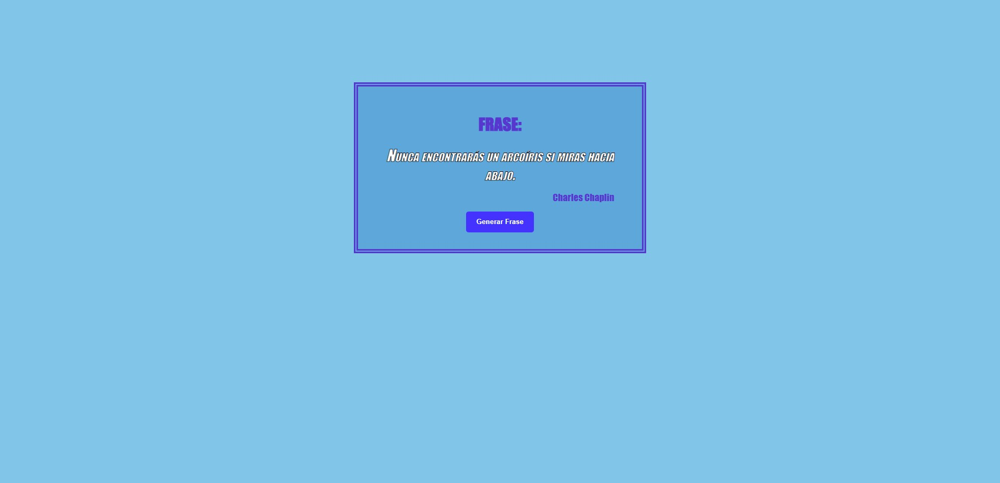

# Change Phrase

*In this project I proposed the creation of a button which will change the phrase on the screen.*  

### I used

*   Array implementation with objects.
*   Implementation of ForEach.

